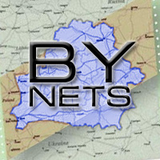

# 
Welcome to ByNets!
 #

ByNets is a non-commercial project which aims to join all sorts of IRC networks
in Belarus, providing a common communication platform for universities campuses,
libraries, student halls and companies.

ByNets was founded in 2004.

You can reach the ByNets IRC network by using a traditional [IRC
Client](https://en.wikipedia.org/wiki/Comparison_of_Internet_Relay_Chat_clients) of choice.

**Connection Details:**

 * [**ircs://irc.bynets.org:6698**](ircs://irc.bynets.org:6698) for SSL with UTF-8 encoding (alternative port: 6669), IPv4 and IPv6.
 * [**irc://irc.bynets.org:6668**](irc://irc.bynets.org:6668) for non-SSL with UTF-8 encoding, IPv4 and IPv6.
 * [**ircs://irc.bynets.org:6697**](ircs://irc.bynets.org:6697) for SSL with CP1251 encoding (alternative ports: 5190, 9944), IPv4 and IPv6.
 * [**irc://irc.bynets.org:6667**](irc://irc.bynets.org:6667) for non-SSL with CP1251 encoding, IPv4 and IPv6.
 * SSL is supported on all of our servers. The server certificates are signed
   by the [Let's Encrypt](https://letsencrypt.org/) certification authority.

We offer IRC services (NickServ, ChanServ) for nick and channel registration.

If you have support requests regarding the operation of the network please stop
by `#help` or email `angor@bynets.org`.

<h1>News</h1>

<h2>{{ post.date | date: "%B %Y" }} </h2>
{{ post.content }}


<em><a href="feed.xml">Atom/RSS news feed</a></em>

